# ComfyUI-Lux3D & LuxReal Engine Nodes

<div align="center">

[English](README.md)/[中文](README_CN.md)

🌐 Official Website: [Lux3D China](https://www.luxreal.com/lux3d/home) | [Lux3D Global](https://www.luxreal.ai/lux3d/home)
</div>

A ComfyUI extension for converting 2D images into 3D models in your workflow. Supports real-time rendering, scene template switching, material preview, and rendering of various render passes (channel maps).

## Related Project

Looking for a Skill Hub version of Lux3D? Try [Lux3d on ClawHub](https://clawhub.ai/violalulu/lux3d) for a workflow-focused skill entry.

## Industry Applications

From gaming to e-commerce, Lux3D powers the next generation of 3D content creation.

### E-Commerce

Create 3D product visualizations for immersive shopping experiences.

- Product configurators
- AR Try-On
- Virtual Showrooms

<table>
<tr>
<th align="center" width="50%">Input Image</th>
<th align="center" width="50%">Generated Result</th>
</tr>
<tr>
<td align="center" width="50%">

</td>
<td align="center" width="50%">
<video src="https://github.com/user-attachments/assets/25df0ee3-1100-4201-9670-22ada6e43374" controls width="100%"></video>
</td>
</tr>
<tr>
<td align="center" width="50%">
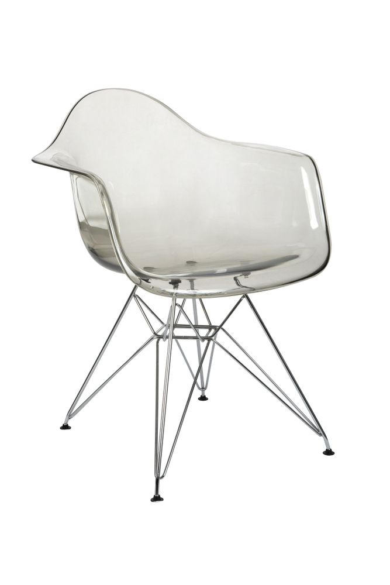
</td>
<td align="center" width="50%">
<video src="https://github.com/user-attachments/assets/6c078cd2-baf3-4577-b0d4-6ef0f52fd621" controls width="100%"></video>
</td>
</tr>
<tr>
  <tr>
<td align="center" width="50%">

</td>
<td align="center" width="50%">
<video src="https://github.com/user-attachments/assets/aeef4778-f5a4-443d-bd1b-3aeefc961506" controls width="100%"></video>
</td>
</tr>
<tr>
<td align="center" width="50%">

</td>
<td align="center" width="50%">

</td>
</tr>
<tr>
<td align="center" width="50%">

</td>
<td align="center" width="50%">

</td>
</tr>
<tr>
<td align="center" width="50%">

</td>
<td align="center" width="50%">

</td>
</tr>
<tr>
<td align="center" width="50%">

</td>
<td align="center" width="50%">

</td>
</tr>
<tr>
<td align="center" width="50%">

</td>
<td align="center" width="50%">

</td>
</tr>
<tr>
<td align="center" width="50%">

</td>
<td align="center" width="50%">

</td>
</tr>
</table>


### Game Development

Rapidly prototype and generate assets for your game worlds.

- Props & Environment
- Character Accessories
- Level Design

<table>
<tr>
<th align="center" width="50%">Input Images</th>
<th align="center" width="50%">Generated Result</th>
</tr>
<tr>
<td align="center" width="50%">


</td>
<td align="center" width="50%">
<video src="https://github.com/user-attachments/assets/5f026961-f276-4ab2-ba0f-a5809d54363a" controls width="100%"></video>
</td>
</tr>
<tr>
<td align="center" width="50%">

</td>
<td align="center" width="50%">
<video src="https://github.com/user-attachments/assets/ee0efc54-96e3-4c1b-8da0-8c3264ebf82e" controls width="100%"></video>
</td>
</tr>
<tr>
<td align="center" width="50%">
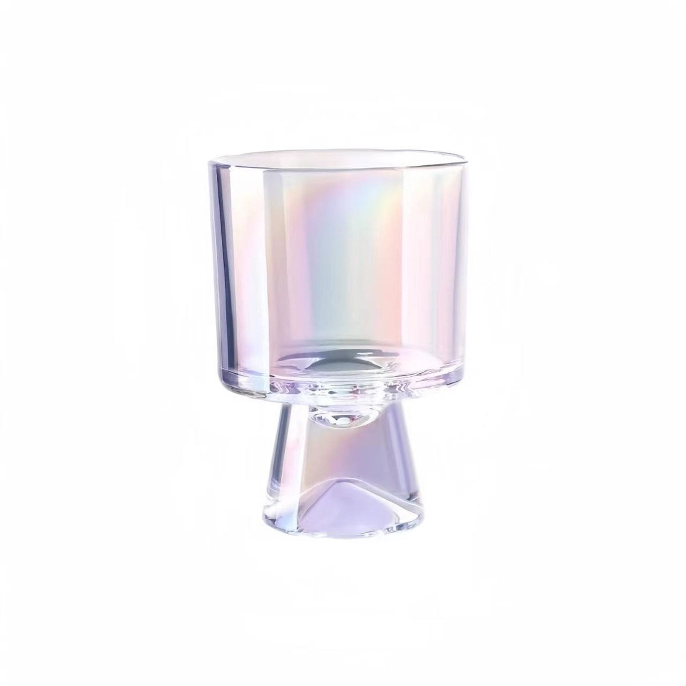
</td>
<td align="center" width="50%">
<video src="https://github.com/user-attachments/assets/4b6ac21f-ad7f-409f-acf4-554d8a33ec81" controls width="100%"></video>
</td>
</tr>
</table>

### Industrial Design

Visualize concepts and prototypes with speed and precision.

- Concept Visualization
- Digital Twins
- Rapid Prototyping

<table>
<tr>
<th align="center" width="50%">Input Images</th>
<th align="center" width="50%">Generated Result</th>
</tr>
<tr>
<td align="center" width="50%">


</td>
<td align="center" width="50%">
<video src="https://github.com/user-attachments/assets/67ed25c7-a843-4484-a509-fbc53fc11630" controls width="100%"></video>
</td>
</tr>
</table>

### Furniture & Interior

Rapidly digitize furniture and create realistic 3D assets for interior planning.

- Furniture Digitization
- Room Planning
- Virtual Staging

<table>
<tr>
<th align="center" width="50%">Input Image</th>
<th align="center" width="50%">Generated Result</th>
</tr>
<tr>
<td align="center" width="50%">
  
</td>
<td align="center" width="50%">
  <video src="https://github.com/user-attachments/assets/3ca88eb5-5cc3-4952-aedd-74ab8df1fede" controls autoplay loop muted width="100%"></video>
</td>
</tr>
<tr>
<td align="center" width="50%">
  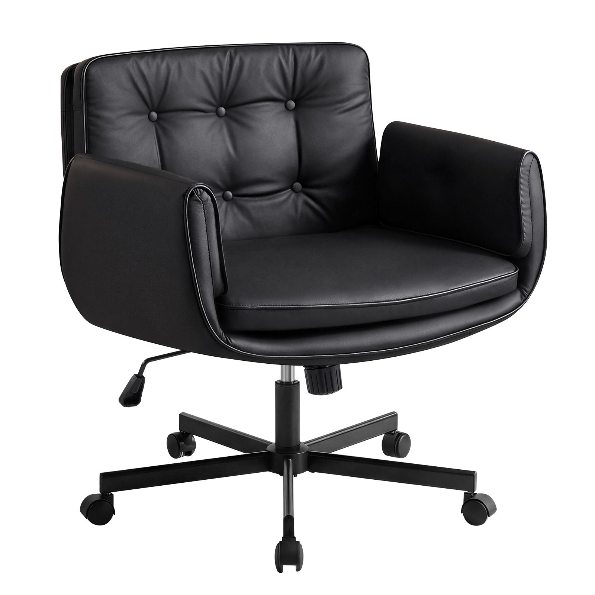
</td>
<td align="center" width="50%">
  <video src="https://github.com/user-attachments/assets/7536eb17-c717-4291-b59e-e21d886096a8" controls autoplay loop muted width="100%"></video>
</td>
</tr>
<tr>
<td align="center" width="50%">
  
</td>
<td align="center" width="50%">
  
</td>
</tr>
<tr>
<td align="center" width="50%">
  
</td>
<td align="center" width="50%">
  
</td>
</tr>
</table>

## Features

### Lux3D Node


- Accepts ComfyUI standard `IMAGE` input via node connections

- `api_key` can be provided via node parameters or read from a config file

- Supports task submission and status polling

- Waits up to **15 minutes** (60 polls × 15-second interval)

- Outputs the generated 3D model URL

### LuxReal Engine Node


- Supports up to **5 Lux3D inputs** and **5 local file inputs**

- Build and update real-time rendering setups (render designs)

- `api_key` can be provided via node parameters or read from a config file

- Real-time WebSocket message push

- Offline rendering outputs **6 image passes**:
  
  - Render Image (RGB)
  
  - Material ID Pass (Material Id)
  
  - Model ID Pass (Model Id)
  
  - Depth (Depth EXR)
  
  - Diffuse (Diffuse)
  
  - Normal (Normal)

- Configurable output **resolution** (1K/2K/4K/8K) and **aspect ratio** (1:1 / 16:9 / 9:16 / 4:3 / 3:4)

## Installation

### Install via ComfyUI CLI (Recommended)

```
comfy node install lux3d
```

### Install via ComfyUI Manager

1. Open ComfyUI.

2. Go to **Manager → Custom Nodes**.

3. Click **Install via URL**.

4. Enter: https://github.com/manycore-research/ComfyUI-Lux3D.git

### Manual Installation

1. Clone this repo into ComfyUI’s `custom_nodes` directory:

```
cd path/to/ComfyUI/custom_nodes 
git clone git@github.com:manycore-research/ComfyUI-Lux3D.git
```

2. Install dependencies (if needed):

```
pip install -r requirements.txt
```

3. Configure the API key:
- Add `lux3d_api_key` to `config.txt`, or

- Enter it directly in the node parameter field when using the node.
4. Restart ComfyUI.

## Usage

### How to Get lux3d_api_key

[Click the link](https://forms.cloud.microsoft/r/kRTjdDBV1e), leave your personal information, and we will send the `api_key` to your email.

If you have any questions, please contact [lux3d@qunhemail.com](mailto:lux3d@qunhemail.com). We will respond as soon as possible.

### Using the Lux3D Node

1. In ComfyUI’s node library, find `Lux3D` under the `Lux3D` category,or double click the blank area to add.
   
   .png)

2. Connect an `IMAGE`input port.

3. Run the workflow.

4. The node returns a download URL for the generated 3D model.
   
   .png)
   
  ### Using the LuxReal Engine Node

1. In the ComfyUI workspace, find `LuxReal Engine` under the `Lux3D` category in the node menu.

2. Connect input ports:
- **lux3d_input**: connect up to 5 glb_model_url outputs from Lux3D nodes.

- **file_input**: connect a local GLB model path or directly enter a .glb file path.
  
  .png)
3. Upload models and synchronize them to the render scene.
   
   

4. Edit the scene:
- Switch scene templates:
  
  

- Switch lighting presets:
  
  

- Edit object transforms:
  
  
5. Configure parameters:
- `resolution`: output resolution (1K/2K/4K/8K)

- `ratio`: aspect ratio (1:1 / 16:9 / 9:16 / 4:3 / 3:4)

- `lux3d_input_1~5`: Lux3D output URLs

- `file_input_1~5`: local file paths (supports GLB/OBJ)

- `seed`: random seed
6. Connect output ports:
   
   .png)
- `render_image`: rendered image

- `material_ch`: material 

- `model_ch`: model 

- `depth`: depth 

- `diffuse`: diffuse 

- `normal`: normal 
7. Run the workflow:
- Input objects are rendered in real time within the scene

- The node pushes an iframe URL to the frontend via WebSocket

- Load the iframe to view the rendered content

## Node Explanation

### Lux3D Node

Core node for converting a 2D image into a 3D model.

#### Inputs

| **Name**      | **Type** | Description                                                  |
| ------------- | -------- | ------------------------------------------------------------ |
| image         | IMAGE    | Input image; accepts ComfyUI standard `IMAGE` via connection |
| base_api_path | STRING   | API server base URL                                          |
| lux3d_api_key | STRING   |                                                              |

#### Outputs

| **Name**      | Type   | Description                            |
| ------------- | ------ | -------------------------------------- |
| glb_model_url | STRING | Download URL of the generated 3D model |

### LuxReal Engine Node

Node for real-time rendering and material preview.

#### Inputs

| **Name**        | **Type** | **Default**     | Description                                  |
| --------------- | -------- | --------------- | -------------------------------------------- |
| resolution      | Enum     | 1K              | Output resolution (1K/2K/4K/8K)              |
| ratio           | Enum     | 16:9            | Aspect ratio (1:1 / 16:9 / 9:16 / 4:3 / 3:4) |
| lux3d_input_1~5 | STRING   | None            | Lux3D output URLs                            |
| file_input_1~5  | STRING   | None            | Local file paths (supports GLB/OBJ)          |
| base_api_path   | STRING   | Default API URL | API server base URL                          |
| seed            | INT      | 0               | Random seed                                  |
| _upload_cache   | STRING   | {}              | Upload cache (auto-passed)                   |

#### Outputs

| **Name**     | Type  | **Description**        |
| ------------ | ----- |------------------------|
| render_image | IMAGE | Final rendered image   |
| material_ch  | IMAGE | Material channel image |
| model_ch     | IMAGE | Model channel image    |
| depth        | IMAGE | Depth map              |
| diffuse      | IMAGE | Diffuse                |
| normal       | IMAGE | Normal                 |
## Examples

- Use Lux3D + LuxReal Engine to generate an object model and render images:
  
  - Workflow overview:

    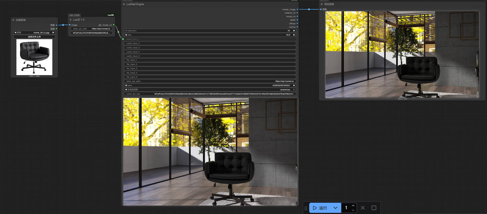

- Use Lux3D + LuxReal Engine with local models to create combined objects and arrange a scene for rendering:
  
  - Workflow overview:

    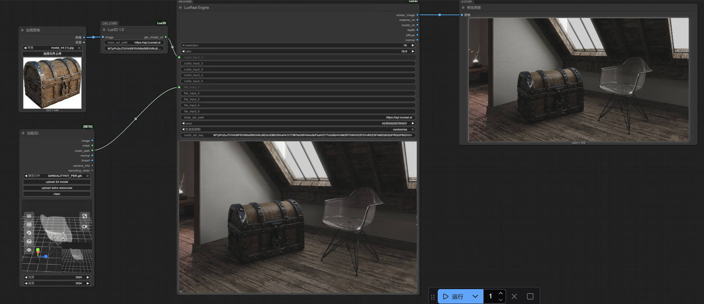

- Use LuxReal Engine to generate object/channel passes and re-generate parts of an object’s materials after editing:
  
  - Workflow overview (1/3):

    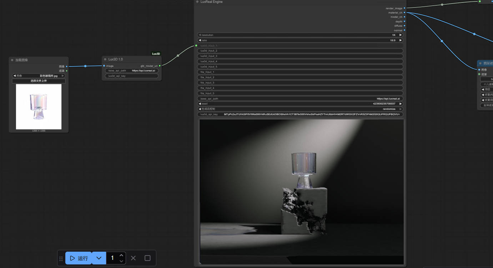

  - Workflow overview (2/3):

    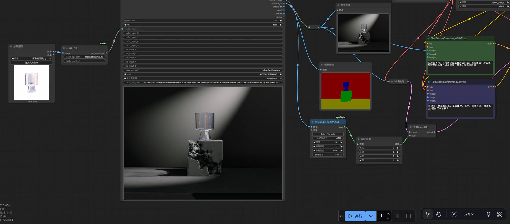

  - Workflow overview (3/3):

    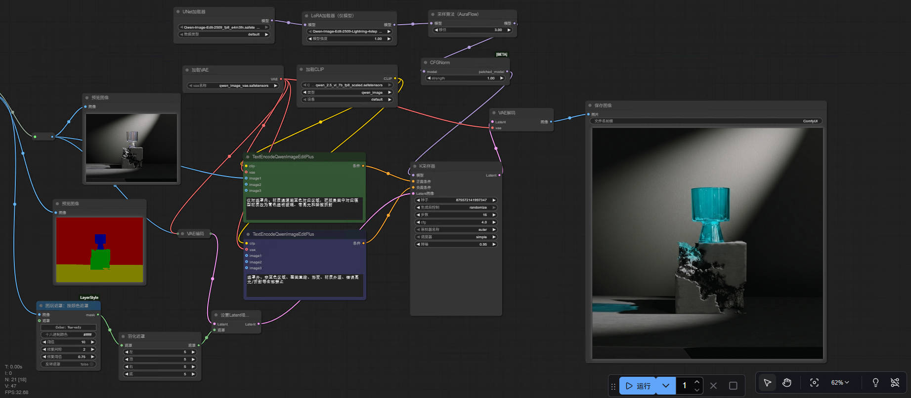

  - Intermediate output 1:

    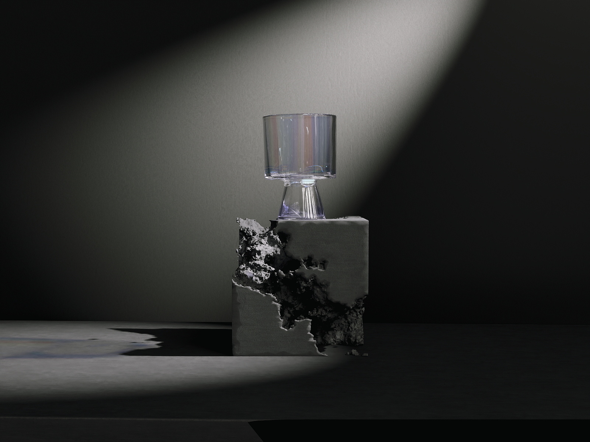

  - Intermediate output 2 (channel pass):

    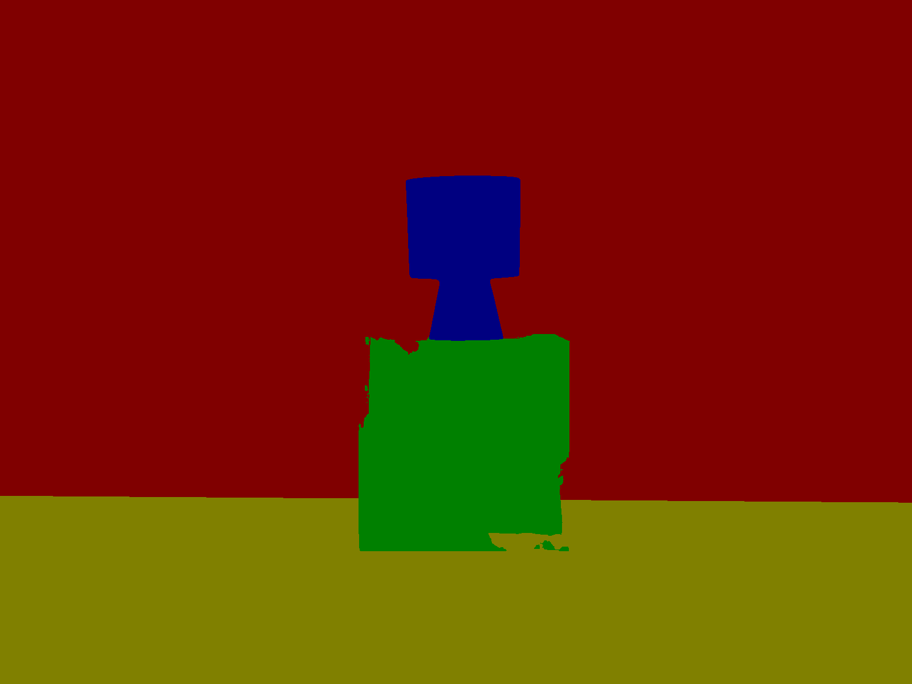

  - Final result:

    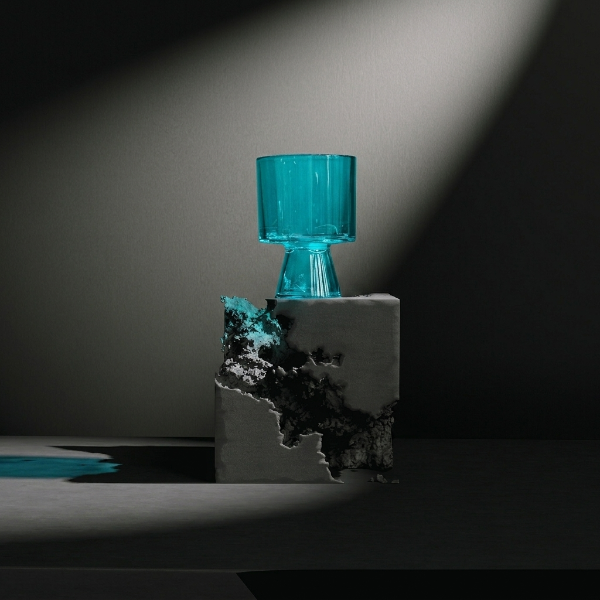

  - In addition to editing rendered images of generated models, you can also edit the input image to regenerate a new model and render.

## FAQ

1.When installing plugins through comfyui-manager, if you encounter security level issues, please modify the corresponding security level in the comfyui-manager configuration file and then retry the installation.

## Development

### Project Structure

```
comfyui-lux3d/
├── __init__.py               # Node registration
├── lux3d_node.py             # Lux3D core node implementation
├── luxreal_engine.py         # LuxReal Engine node implementation
├── render/                   # Rendering modules
│   ├── __init__.py
│   ├── offline_render.py     # Offline rendering
│   ├── build_render_design.py# Render design builder
│   ├── image_to_torch.py     # Image conversion utilities
│   └── model_upload.py       # Model upload utilities
├── sso/                      # SSO authentication config
│   └── sso_token.py          # SSO token loader
├── upload/                   # Upload module
│   ├── __init__.py
│   └── upload.py             # Upload implementation
├── js/                       # Frontend JavaScript
│   └── lux3d_viewer.js       # 3D viewer
├── requirements.txt          # Dependencies
├── config.txt.example        # Example config
└── README.md                 # Documentation
```

### Dependencies

| **Dependency** | **Version**                                                           | **Purpose**                      | **License** |
| -------------- |-----------------------------------------------------------------------| -------------------------------- | ----------- |
| requests       | &gt;=2.25.0                                                           | HTTP client for API calls        | Apache 2.0  |
| Pillow         | &gt;=9.0.0                                                            | Image processing                 | BSD         |
| NumPy          | &gt;=1.21.0                                                           | Numerical computing              | BSD         |
| OpenEXR        | ==3.4.4 (python_version == "3.12");==3.2.4(python_version == "3.11")  | EXR image processing (for depth) | BSD         |


## Configuration

### config.txt.example

Copy `config.txt.example` to `config.txt` and set:

```
lux3d_api_key=your_lux3d_api_key
```

## Changelog

(To be added)

## License

[MIT](LICENSE)
